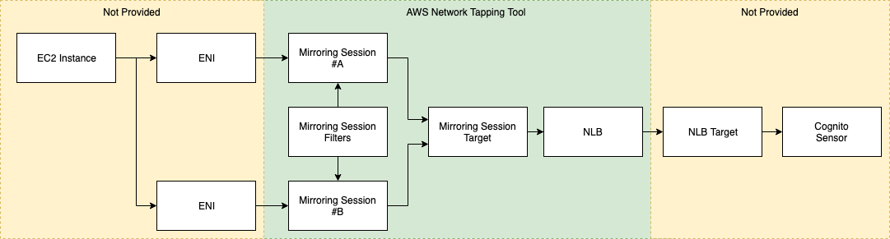
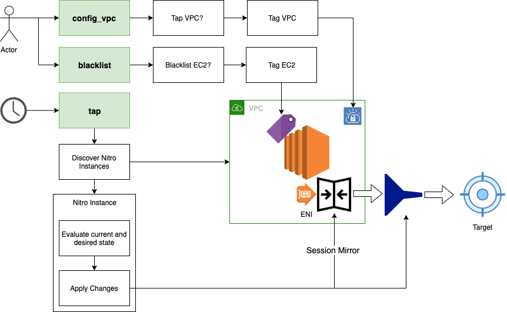

# AWS Session Mirroring Tool

This tool automates the creation and maintenance AWS Session Mirrors (Network Taps) of Nitro based EC2 instances.

| Notice: Usage of this tool can lead to significant AWS charges from the network taps created or the NLB data transfer charges. No warranty or recourse are provided. |
| --- |

What this tool solves:

- Creating/removing session mirrors on EC2 instances.
- 'healing' session mirrors in response to instance lifecycle events (created/destryed), when this tool is scheduled to run under AWS Lambda.

The tool can selectively tap all VPCs in an account, as well as tap each ENI (Elastic Network Interface) interface on an EC2.

AWS Session Mirroring Architecture

This configuration scripts (session_mirror_blacklist, session_mirror_config_vpc) do the following:

1. Denote VPCs that should be tapped using AWS Tags
1. Denote EC2s that should be blacklisted using AWS Tags
1. [Optional] Create an AWS NLB (network load balancer) to be the target of Session Mirroring Traffic 

The runtime script (session_mirror_tap) does the following:

1. Discover all Nitro instances in the VPC, and their respective ENI's 
1. Create Session Mirrororing Filters
1. Create Traffic Mirroring Session on the ENI using Filters

## Getting Started

### Requirements
- Python 3.6+
- virtualenv
- [AWS Credentials with appropriate permissions](https://docs.aws.amazon.com/cli/latest/userguide/cli-configure-files.html) or install them with [AWS CLI](https://aws.amazon.com/cli/)

### Installing
1. Clone this repo
    
        
    git clone git@github.com:vectranetworks/AWS-Session-Mirroring-Tool.git
        
3. Install the commands

    
    python setup.py install

### Configuring an AWS Account for Session Mirroring
Before tapping can happen, Each VPC need to be configured for tapping, 
and any instances that should be blacklisted need to be indicated.
This is done by applying tags to the AWS Account.

1. Blacklist any Vectra appliance instance ids, as this would create a circular tap that eats up all bandwidth:

    session_mirror_blacklist (Interactive)

1. Configure which VPCs should be tapped:

    session_mirror_config_vpc (Interactive)
    
### Installing the Session Mirrors (Network Taps)
Run the tapping tool to tap all available interfaces. 
Run this command again any time instances are added or removed from the network.

    session_mirror_tap (Unattended)

## Development

    ./venv.sh
    source .venv/bin/activate

1. Setup Virtualenv
   
2. Set the blacklist to include the Cognito Brain and Sensor instance ids by editing aws_network_tap.spile_driver

3. Run the tapper

    cd ..
    python -m aws_network_tap.spile_driver 
